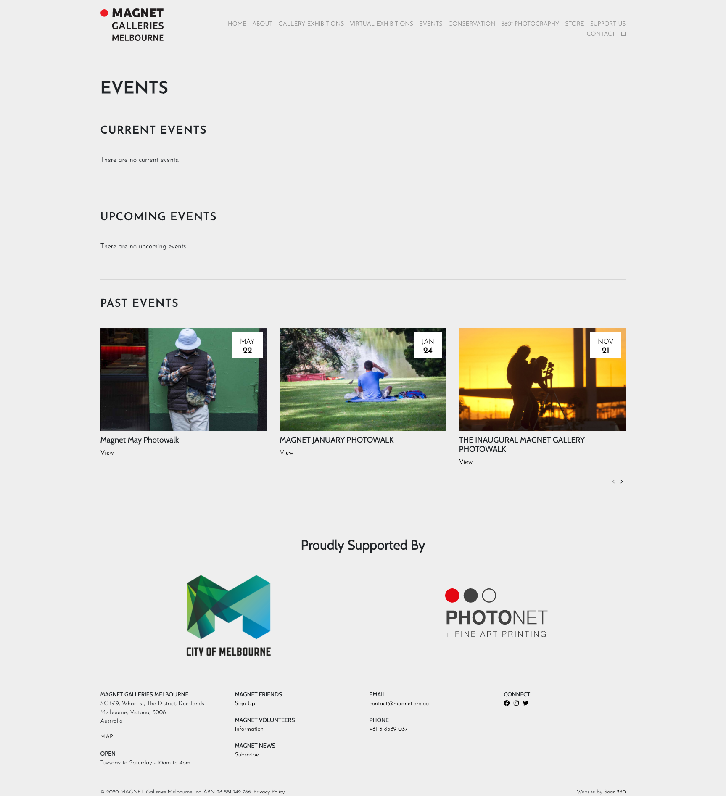

# Events
---------
- [ ] Use virtual exhibitions layout to display events
- [ ] Remove current/upcoming/past events. Just have a list and dates.
- [ ] Display descriptive event information.
- [ ] Remove 'supported by' widget
- [ ] Add subscribe to mailing list widget
---------
- How to make events listing more engaging? 
