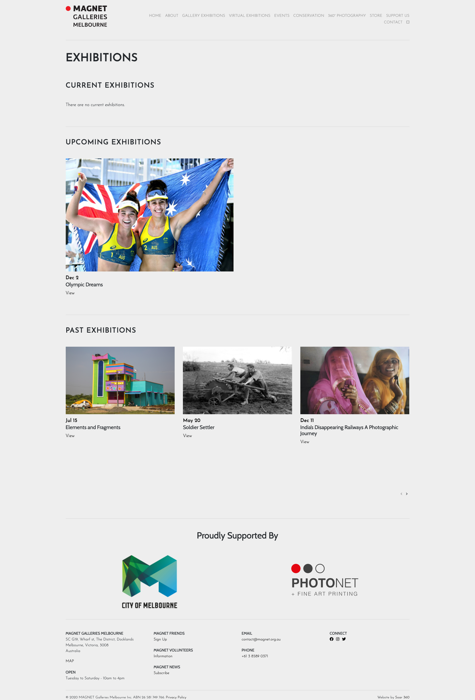
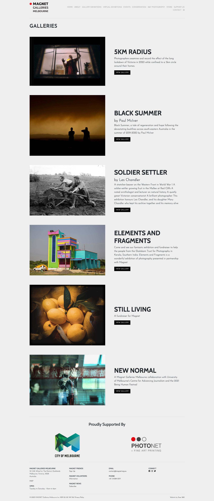

# Exhibitions
===
[ ] Combine Virtual and Gallery Exhibitions
[ ] Use virtual exhibition layout
[ ] Full banner current/up coming exhibitions
[ ] Make vertical page alignment/layout consistent
[ ] Add exhibition standard photographer, date attributions.
[ ] Tile past exhibitions
[ ] Remove 'proudly supported by' widget
[ ] Add 'mailing list widget' to subscribe to news about exhibitions
[ ]
===
[ ] 'No current exhibitions' does not reflect the activity that goes on in Magnet when exhibitions aren't on. Propose to change to current and upcoming/work in progress exhibitions?